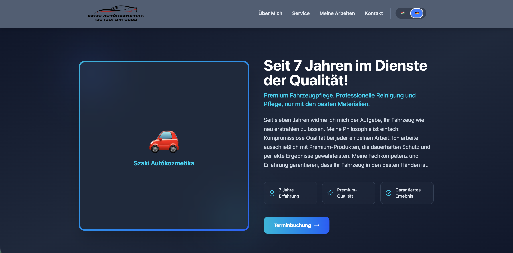

# Szaki Autókozmetika - Website

Modern, multilingual car detailing service website built with React and TypeScript.

## 🚗 About The Project

A premium car detailing service showcase website featuring a single-page application with three language support (Hungarian, German, English), responsive design, and smooth animations.

## ✨ Features

- 🌍 **Multilingual Support** - Hungarian and German
- 📱 **Fully Responsive** - Mobile, tablet, and desktop optimized
- 🎨 **Modern UI/UX** - Tailwind CSS with Framer Motion animations
- 🖼️ **Image Gallery** - Showcase of previous work
- 🗺️ **Google Maps Integration** - Location display
- ⚡ **Fast Loading** - Optimized with Vite build tool
- 🎯 **Smooth Scroll** - Animated navigation between sections

## 🛠️ Tech Stack

- **Frontend Framework:** React 18+
- **Language:** TypeScript
- **Build Tool:** Vite
- **Styling:** Tailwind CSS
- **Animations:** Framer Motion
- **Internationalization:** react-i18next
- **Icons:** Lucide React

## 📦 Installation

### Prerequisites

- Node.js 18+ and npm/yarn

### Steps

1. **Clone the repository**
   git clone https://github.com/horvathmartin97/szakicarcosmetic.git
   cd szakicarcosmetic

text

2. **Install dependencies**
   npm install

or
yarn install

text

3. **Start development server**
   npm run dev

or
yarn dev
